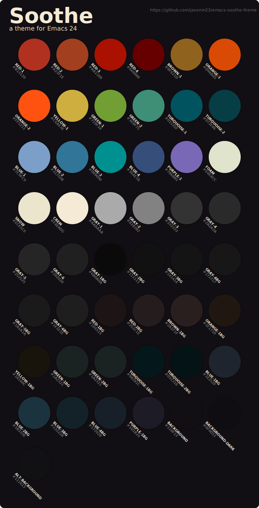

[](http://stable.melpa.org/#/soothe-theme) [](http://melpa.org/#/soothe-theme)

# Soothe-theme

A colorful, muted theme for Emacs, dark background with light text. 



## Installing

Simply setup Emacs to use [MELPA](http://melpa.org/#/getting-started) and
install Soothe like this:

    M-x package-install <RET> soothe-theme
    
Now you can do: `M-x load-theme <RET> soothe`

To have Soothe always enabled when you start Emacs, add the following to your
`~/.emacs` (or `~/.emacs.d/init.el`) file:

```
(load-theme 'soothe)
```

### Screenshots

#### Vertico Posframe


#### EmacsLisp


#### Markdown


#### Swift


#### HTML & Which-key


